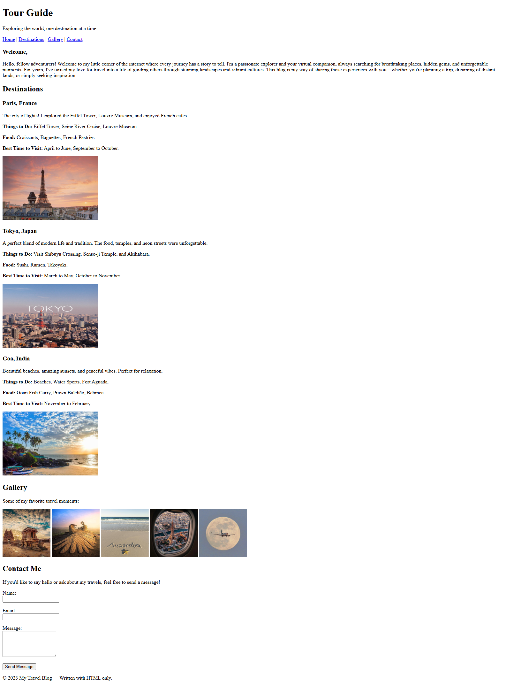

# 🚀 Level 1 – HTML Projects  
Welcome to my **Level 1 HTML Projects** collection!  
This folder includes foundational, beginner-friendly web projects built with plain HTML only. Perfect for honing your web fundamentals.

---

## 📂 Projects Overview  
### Project 1  
  
**Description:** A simple HTML project. Explain what the project does, its purpose, and highlight one or two features.  
**Tech Stack:** HTML 
**Repository / Source:** [Project 1](./project-1/index.html)

### Project 2  
  
**Description:** Another foundational HTML project. Describe functionality, goal, and key learning outcomes.  
**Tech Stack:** HTML 
**Repository / Source:** [Project 2](./project-2/index.html)

---

## 🎯 Why This Folder?  
- Builds strong HTML fundamentals — structure, semantics, links, images, forms.  
- Great for beginners or those brushing up web basics.  
- Each project is small, manageable, and focused — ideal for learning and showcasing.

---

## 🛠 Future Enhancements  
- Add more projects to expand the collection.    
- Include **feature lists**, **installation instructions**, and **screenshots/GIFs**.  
- Add tags/badges (e.g., HTML5, beginner, web-dev) for better visibility.

---

## 🤝 Contributing  
Feel free to fork this, suggest improvements, or add your own projects following the same structure. Open an issue or submit a pull request — contributions are welcome!

---

## 📬 Contact  
If you’d like to connect, collaborate, or ask questions — feel free to reach out!  
⭐ If you found something useful here, don’t forget to **star** the repository.
