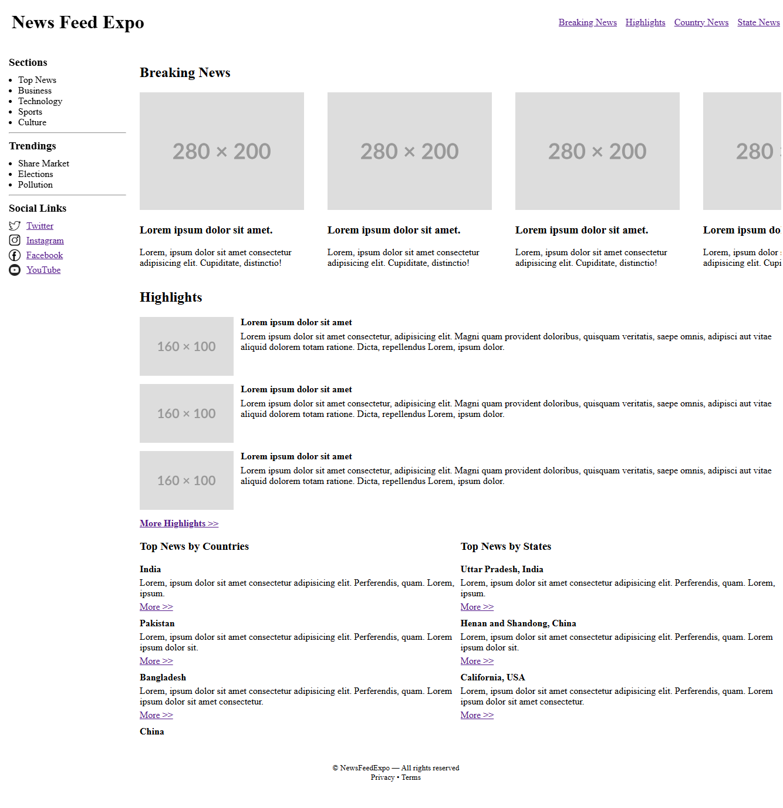
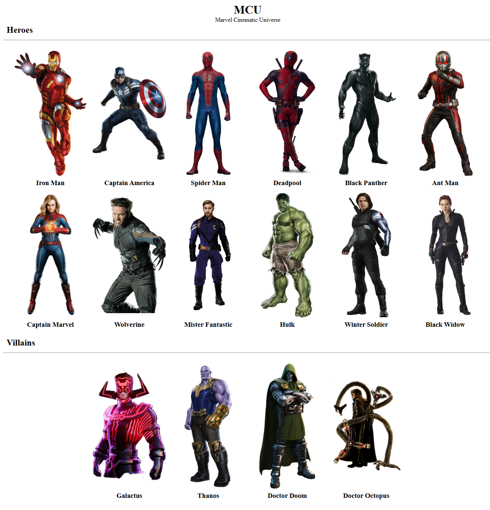

# HTML Tags Reference Guide

Quick reference for all HTML tags used in Projects 1 & 2.

---

## 📸 Project Screenshots

### Project 1: News Feed Expo

*A news feed layout with fixed header, sidebar, and scrollable content sections.*

### Project 2: MCU Gallery View

*A character gallery displaying Marvel heroes and villains in a flexbox grid.*

---

## Document Structure

### `<!DOCTYPE html>`
Declares HTML5 document type. Always first line.

### `<html lang="en">`
Root element, wraps entire page.

### `<head>`
Contains metadata (title, charset, viewport).

### `<body>`
Contains all visible page content.

---

## Metadata

### `<meta>`
Page metadata: `charset="UTF-8"`, `viewport` settings.

### `<title>`
Browser tab title.

---

## Layout Sections

### `<header>`
Top section with logo/navigation. Use `position: fixed` for sticky headers.

### `<nav>`
Navigation menu container.

### `<aside>`
Sidebar content. Use `position: fixed; left: 0` for sticky sidebars.

### `<main>`
Primary page content. Adjust `margin` for fixed header/sidebar.

### `<section>`
Thematic content group with heading.

### `<article>`
Self-contained content (cards, posts, items).

### `<footer>`
Bottom section with copyright/links.

---

## Content Tags

### `<h1>` to `<h6>`
Headings (h1 largest → h6 smallest).

### `<p>`
Paragraph text.

### `<div>`
Generic container for grouping/layout.

### `<ul>` and `<li>`
Unordered list and list items.

### `<hr>`
Horizontal divider line.

---

## Text Tags

### `<a href="#">`
Link to pages or sections (`#id` for anchor links).

### `<strong>`
Important text (bold).

### `<small>`
Fine print/copyright text.

---

## Media

### ``
Image element.
- `src` - image URL
- `alt` - description text
- `width`, `height` - dimensions
- `style="object-fit: contain"` - maintain aspect ratio

---

## CSS Rules

### ✅ **Allowed** (Layout/Position Only)
- **Display**: `display: flex`, `flex-wrap: wrap`, `flex: 1`
- **Position**: `position: fixed/relative/absolute`, `top/right/bottom/left`, `z-index`
- **Spacing**: `margin`, `padding`, `gap`
- **Size**: `width`, `height`
- **Align**: `justify-content`, `align-items`, `text-align`
- **Overflow**: `overflow: auto`

### ❌ **Not Allowed**
- Colors, backgrounds, fonts, borders, shadows
- External/internal CSS files or `<style>` tags

---

## Common Patterns

**Fixed Header:**
```html
<header style="position: fixed; top: 0; left: 0; right: 0; z-index: 100;">
```

**Fixed Sidebar:**
```html
<aside style="position: fixed; top: 80px; left: 0; width: 200px;">
```

**Main with Offset:**
```html
<main style="margin: 80px 0 0 220px;">
```

**Flex Grid:**
```html
<div style="display: flex; flex-wrap: wrap; gap: 15px; justify-content: center;">
```

**Horizontal Scroll:**
```html
<div style="display: flex; gap: 40px; overflow: auto;">
```
